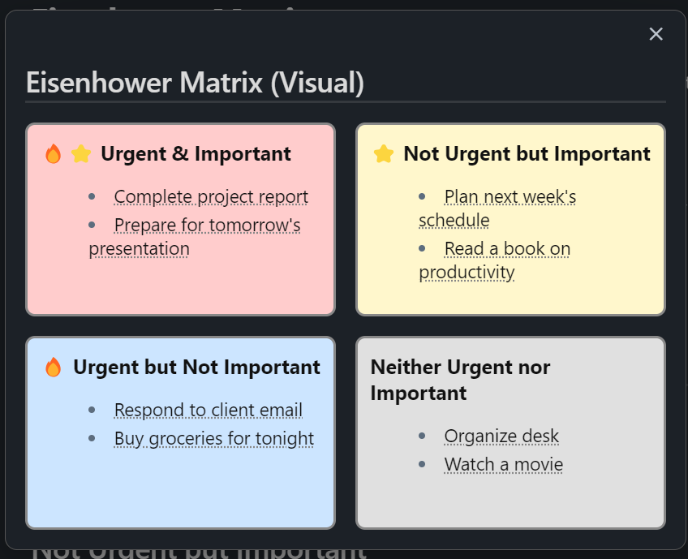

# My Obsidian Plugin

## Overview
This is a plugin for Obsidian that enhances your note-taking experience by providing additional features and functionalities.

## Features

### 🎯 **Eisenhower Matrix**
- Categorizes tasks by importance and urgency with visual HTML matrix
- Color-coded quadrants for quick task prioritization
- Interactive checkboxes for task completion
- Click tasks to jump to source file
- Supports emoji customization for importance, urgency, and duration

### 🔁 **Habit Tracker with Motivational Colors**
- Daily and weekly habit tracking with visual feedback
- **Motivational color system** that evolves based on your progress:
  - 🌱 **Starting Out** (0-2): Light gray - Building foundations
  - 💧 **Building Momentum** (3-5): Light blue - Gaining consistency
  - 🌊 **Getting Consistent** (6-8): Medium blue - Developing routine
  - ⚡ **Strong Habit** (9-11): Deeper blue - Habit forming
  - 🌿 **Habit Established** (12-15): Light green - Well established
  - 🍃 **Mastery Building** (16-20): Medium green - Approaching mastery
  - ⭐ **Golden Streak** (21-30): Gold - Exceptional consistency
  - 👑 **Legend Status** (31+): Purple - Master level achievement
- **Warning system** for negative tracking (procrastination, missed goals)
- Accumulated task counters with increment/decrement controls
- Persistent sidebar pane with auto-refresh
- Achievement badges and level descriptions

### ⏳ **Scheduled Tasks**
- Support for date-specific tasks with `⏳ YYYY-MM-DD` format
- Integration with habit tracker for today's scheduled items

### 📊 **Weekly Summaries**
- Extracts content under configurable headers from daily notes
- Creates comprehensive weekly summaries

## Installation
1. Download the plugin files.
2. Place the plugin folder in your Obsidian plugins directory.
3. Enable the plugin in the Obsidian settings under the "Community Plugins" section.

## Usage

### Commands
- **Show Eisenhower Matrix**: Opens visual matrix modal with interactive task management
- **Open Daily Habit Tracker (Pane)**: Opens persistent sidebar tracker with motivational colors
- **Show Daily Habit Tracker**: Opens modal habit tracker
- **Add Eisenhower Properties to Task**: Interactive task property editor
- **Summarize Week**: Extracts content from recent notes and copies summary prompt

### Task Syntax

#### Basic Task Properties
```markdown
- [ ] Task name [importance::high] [urgency::low] [duration::30]
- [ ] Quick task ⭐ 🔥 ⏳15
```

#### Habit Tracking with Motivational Colors
```markdown
- [ ] Daily habit [habit::daily]
- [ ] Weekly habit [habit::weekly]
- [ ] Accumulated task [accumulated::true] [success::5]
- [ ] Emoji-based habit 🔁
- [ ] Accumulated emoji task 🪙 [15]
- [ ] Negative tracking [accumulated::true] [success::-3]
```

#### Scheduled Tasks
```markdown
- [ ] Meeting today ⏳ 2025-06-08
- [ ] Project deadline ⏳ 2025-06-15
```

### Visual Indicators
- ⭐ = Important tasks
- 🔥 = Urgent tasks  
- ⏳ = Duration/scheduled indicators
- 🔁 = Daily habits
- 🪙 = Accumulated tasks
- 🌱💧🌊⚡🌿🍃⭐👑 = Achievement level badges

## Eisenhower Matrix Visualization



## Example Tasks

### Eisenhower Matrix Examples
```markdown
- [ ] Complete project report 🔥⭐ importance::high urgency::high
- [ ] Plan next week's schedule ⭐ importance::high urgency::low
- [ ] Respond to client email 🔥 importance::low urgency::high
- [ ] Organize desk importance::low urgency::low
```

### Motivational Color System Examples
```markdown
🌱 Starting Out (0-2)
- [ ] Learn something new [accumulated::true] [success::0]
- [ ] Practice guitar [accumulated::true] [success::2]

💧 Building Momentum (3-5)
- [ ] Exercise daily [accumulated::true] [success::4]
- [ ] Read 10 pages [accumulated::true] [success::5]

🌊 Getting Consistent (6-8)
- [ ] Meditate [accumulated::true] [success::7]
- [ ] Write journal [accumulated::true] [success::8]

⚡ Strong Habit (9-11)
- [ ] Morning routine [accumulated::true] [success::10]
- [ ] Evening routine [accumulated::true] [success::11]

🌿 Habit Established (12-15)
- [ ] Brush teeth [accumulated::true] [success::13]
- [ ] Take vitamins [accumulated::true] [success::15]

🍃 Mastery Building (16-20)
- [ ] Daily standup [accumulated::true] [success::18]
- [ ] Clean workspace [accumulated::true] [success::20]

⭐ Golden Streak (21-30)
- [ ] Wake up early [accumulated::true] [success::25]
- [ ] Gratitude practice [accumulated::true] [success::30]

👑 Legend Status (31+)
- [ ] Consistent sleep [accumulated::true] [success::50]
- [ ] Daily exercise [accumulated::true] [success::100]

⚠️ Warning System (Negative Values)
- [ ] Procrastination [accumulated::true] [success::-2]
- [ ] Missed deadlines [accumulated::true] [success::-5]
```

## Contributing
If you would like to contribute to this project, please fork the repository and submit a pull request.

## License
This project is licensed under the MIT License. See the LICENSE file for more details.
